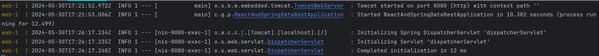
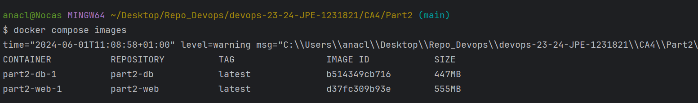
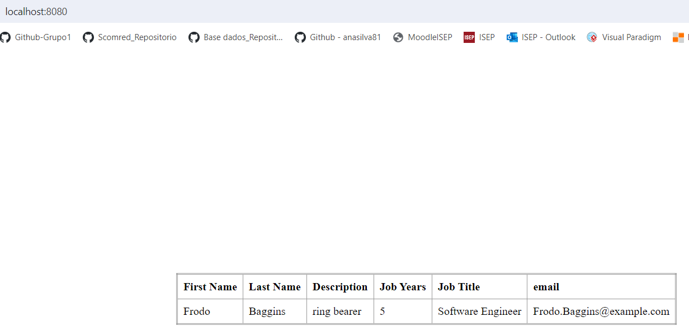
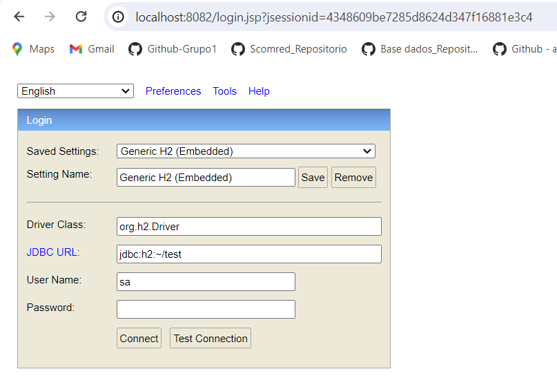
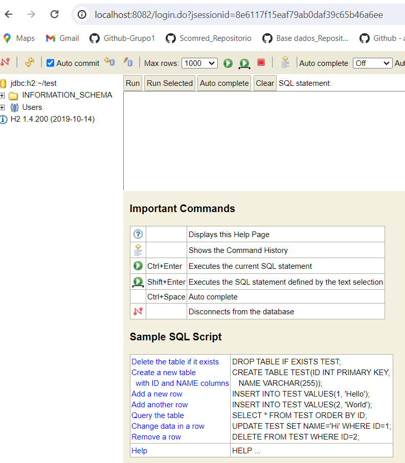

# Technical Report for CA4 Part 2:  Containers with Docker

## Table of Contents

- [Introduction](#introduction)
- [1. Create the dockerfile](#1-create-the-docker-file)
  - [1.1. Web dockerfile](#11-web-dockerfile)
  - [1.2. DB dockerfile](#12-db-dockerfile)
  - [1.3. Docker compose file](#13-yml-file)
  - [1.4. Run the docker-compose](#14-run-the-docker-compose)
- [2. Publish the image in the Docker Hub](#2-publish-the-image-in-the-docker-hub)
- [3. Version Control and Documentation](#3-version-control-and-documentation)
- [Conclusion](#conclusion)


## Introduction
The goal of this assignment is to utilize Docker for setting up a containerized environment to execute the Gradle 
version of the Spring basic tutorial application. By creating a Docker-based solution, we aim to encapsulate the 
application and its dependencies into containers, ensuring consistent and isolated execution environments. The assignment
involves creating Dockerfiles for the web and database services, using Docker Compose to manage the services, and publishing
the Docker images to Docker Hub.


## 1.  Create the docker containers

### 1.1. Web dockerfile
* Specify the base image for the first stage of the build process.
* Set the working directory inside the container to /app. All subsequent commands will be run in this directory.
* Copy all files from the current directory on the host machine to the /app directory in the container.
* Run the gradle build command inside the container, which compiles the code and packages it into a JAR file. The build 
output will be placed in the /app/build/libs directory.
* Start the second stage of the multi-stage build, using openjdk:21 as the base image. This image includes JDK 21, which 
is required to run the Java application.
* Copy the JAR file(s) from the build stage (builder) into the /app directory of the second stage container. 
The path /app/build/libs/*.jar points to where the JAR file(s) were created in the first stage, and they are copied to 
/app in the second stage.
* Expose the port 8080.
/ Specify the command to run when the container starts. It runs the Java application by executing java -jar and specifying 
the path to the JAR file (/app/react-and-spring-data-rest-basic-0.0.1-SNAPSHOT.jar).

```Dockerfile
FROM gradle:jdk21 as builder

LABEL authors="Ana Silva"

WORKDIR /app

COPY . /app

RUN gradle build

FROM openjdk:21

WORKDIR /app

COPY --from=builder /app/build/libs/*.jar /app

EXPOSE 8080

CMD ["java", "-jar", "/app/react-and-spring-data-rest-basic-0.0.1-SNAPSHOT.jar"]
```

### 1.2. DB dockerfile
* Set the base image for the Docker container to Ubuntu 20.04.
* The `RUN` command performs several actions:
  * Updates the list of available packages and their versions.
  * Installs wget (a utility for downloading files from the web) and the headless version of OpenJDK 21 (a Java Development 
  Kit without the graphical user interface components.
  * Cleans up the list of available packages to reduce the image size.
* Set the working directory inside the container to /opt/h2. All subsequent commands will be run in this directory.
* The `RUN` command uses wget to download the H2 database JAR file (version 1.4.200) from the Maven repository and saves 
it as h2.jar in the /opt/h2 directory.
* Expose the port 8082.
* Set the command to run when the container starts. It runs the H2 database server with the following options:
  * -cp h2.jar: Specifies the classpath, which includes the H2 JAR file.
  * org.h2.tools.Server: Specifies the main class to run, which starts the H2 server.
  * -ifNotExists: Ensures that the server starts only if it doesn't already exist.
  * -web: Enables the web console.
  * -webAllowOthers: Allows other computers to connect to the web console.
  * -webPort 8082: Sets the web console port to 8082.
  * -tcp: Enables the TCP server.
  * -tcpAllowOthers: Allows other computers to connect to the TCP server.
  * -tcpPort 9092: Sets the TCP server port to 9092.

```Dockerfile
FROM ubuntu:focal

LABEL authors="Ana Silva"

RUN apt-get update && \
    apt-get install -y wget openjdk-21-jdk-headless && \
    rm -rf /var/lib/apt/lists/* \

WORKDIR /opt/h2

RUN wget https://repo1.maven.org/maven2/com/h2database/h2/1.4.200/h2-1.4.200.jar -O h2.jar

EXPOSE 8082

EXPOSE 9092

CMD ["java", "-cp", "h2.jar", "org.h2.tools.Server", "-ifNotExists", "-web", "-webAllowOthers", "-webPort", "8082", "-tcp", "-tcpAllowOthers", "-tcpPort", "9092"]
```

### 1.3. Docker compose file

In this file, we define the services that will be used in the project. The web service will be built using the 
`Dockerfile_web` and the db service will be built using the `Dockerfile_db`. The web service will be available on port 
8080 and the db service will be available on ports 8082 and 9092. The db service will also have a volume mounted to the 
`./data` directory.
The volumes are used to persist the data in the db service. The networks are used to define the IP addresses of the
services.


```Dockerfile
version: '3'
services:
  web:
    build:
      context: .
      dockerfile: Dockerfile_web
    ports:
      - "8080:8080"
    networks:
      default:
        ipv4_address: 192.168.56.10
    depends_on:
      - "db"
  db:
    build:
      context: .
      dockerfile: Dockerfile_db
    ports:
      - "8082:8082"
      - "9092:9092"
    volumes:
      - ./data:/opt/h2-data
    networks:
      default:
        ipv4_address: 192.168.56.11
networks:
  default:
    ipam:
      driver: default
      config:
        - subnet: 192.168.56.0/24
```

### 1.4. Run the docker compose
To run the docker compose file, run the following commands:

```bash
docker compose up
```



It should run the docker compose file and build the images. To check the images, run:

```bash
docker compose images
```


You can access the pages in the following links:
* Web UI: http://localhost:8080
* DB: http://localhost:8082

Some screenshots of the result:





Login in to the DB with the default password:



Push the changes to the repository:
```bash
git add .
git commit -m "[FEAT] #26 Created docker compose file"
git push
```

## 2. Publish the image in the Docker Hub
To publish the Docker image to Docker Hub, we need to create a repository on Docker Hub and push the image to it. The
following steps outline the process:

* Create an account on Docker Hub (https://hub.docker.com/).
* Create a new repository on Docker Hub.
* Log in to Docker Hub using the terminal.

```bash
docker login
```

* Tag the Docker image with the repository name with the following command:
```bash
docker tag d37fc309b93e  anasilvaswitch/web_ca4_part2
docker tag b514349cb716 anasilvaswitch/db_ca4_part2
```


*Push the Docker image to the repository on Docker Hub with the following command:
```bash
docker push anasilvaswitch/web_ca4_part2
docker push anasilvaswitch/db_ca4_part2
```


*Verify that the images have been successfully pushed to Docker Hub by checking the repository on the Docker Hub website here:
https://hub.docker.com/repository/docker/anasilvaswitch/


## 3. Version Control and Documentation

* Commit your changes and push them to your repository.
```bash
git add .
git commit -m "[DOCS] #27 Created Readme file of CA4 - Part2"
git push origin main
```

  ```bash
    git tag ca4-part2
    git push origin ca4-part2
    
  ```

### Conclusion

By implementing Docker Compose, we created a multi-container setup consisting of a Tomcat server for the Spring 
application and an H2 server database. This setup not only simplifies the deployment process but also ensures consistency 
across different environments.

The Docker images for the web and db services were published to Docker Hub, facilitating easy distribution and deployment. 
Additionally, we utilized Docker volumes to manage database persistence and demonstrated how to interact with the database 
container to copy data files.

By completing this assignment, we have reinforced the importance of containerization in modern software development and 
deployment, equipping ourselves with the skills needed to leverage Docker's full potential in real-world applications.