# Technical Report for CA5-Part1: CI/CD Pipelines with Jenkins

## Table of Contents

- [Introduction](#introduction)
- [1. Installing Jenkins](#1-installing-jenkins)
- [2. CA5 - Part1](#2-ca5---part1)
- [3. CA5 - Part2](#3-ca5--part2)
- [Conclusion](#conclusion)


## Introduction
The goal of this assignment is to practice using Jenkins with the "Gradle Basic Demo" project, in particular, 
CA2/Part1/gradle_basic_demo and CA2/Part2 directories. This project is already present in the individual repository. 
The task involves creating a simple Jenkins pipeline similar to the example from the lectures. The pipeline script is 
design to automate several stages of a Gradle project.


## 1. Installing Jenkins
I used a Docker container to install Jenkins. The following command was used to create the container:

```bash
docker run -d -p 8080:8080 -p 50000:50000 -v jenkins-data:/var/jenkins_home --name=jenkins
jenkins/jenkins:lts-jdk17
```

I also need to configure Jenkins authentication by obtaining the initial password from the container logs. The following
command was used to retrieve the password:

```bash
docker logs jenkins
```

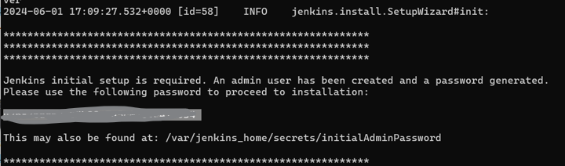
<p></p>
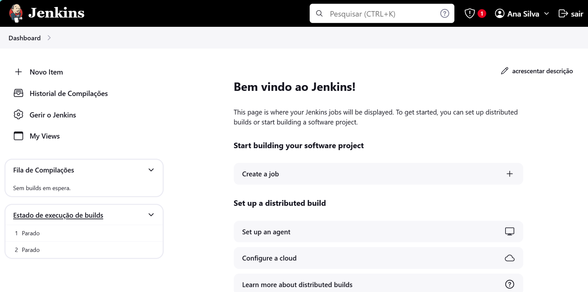


## 2. CA5 - Part1

For this part of the assignment, when configuring the pipeline, in the Script Path field, we should specify the relative
path (inside your repository) for the Jenkinsfile:
* Select Pipeline Script on SCM
* Choose Git
* Add our repository and credentials (if needed)
* Chose branch (in my case is origin/main)
* Specify Jenkinsfile path

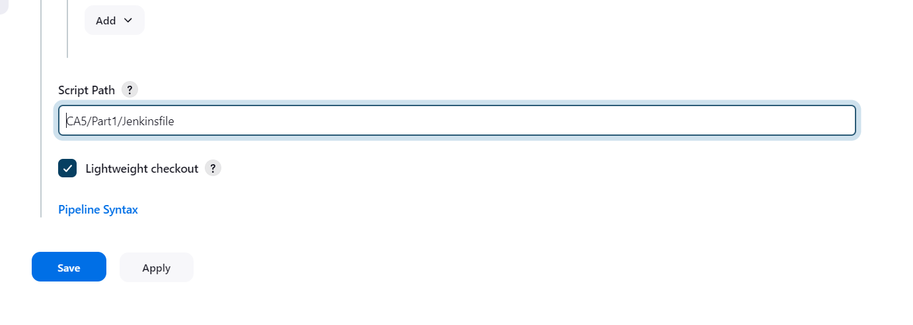

Jenkinsfile should include the following tasks: Checkout, Assemble, Test and Archive.

Jenkinsfile follows the groovy language:

```groovy
pipeline {
    agent any
    stages {
        stage('Checkout') {
            steps {
                echo 'Checking Out'
                script {
                    git branch: 'main',
                        url: 'https://github.com/anasilvaswitch/devops-23-24-JPE-1231821.git'
                }
            }
        }
        stage('Assemble') {
            steps {
                    echo 'Assembling'
                dir('./CA2/Part1/gradle_basic') {
                    sh 'chmod +x ./gradlew'
                    sh './gradlew assemble'
                }
            }
        }
        stage('Test') {
            steps {
                dir('./CA2/Part1/gradle_basic') {
                    echo 'Testing'
                    sh './gradlew test'
                }
            }
            post {
                always {
                    junit '**/build/test-results/**/*.xml'
                }
            }
        }
        stage('Archive') {
            steps {
                echo 'Archiving...'
                archiveArtifacts artifacts: 'CA2/Part1/gradle_basic/build/**/*.jar', onlyIfSuccessful: true
            }
        }
    }
}
```
Then, we should build the pipeline. If this is successful, we should see the result like this:

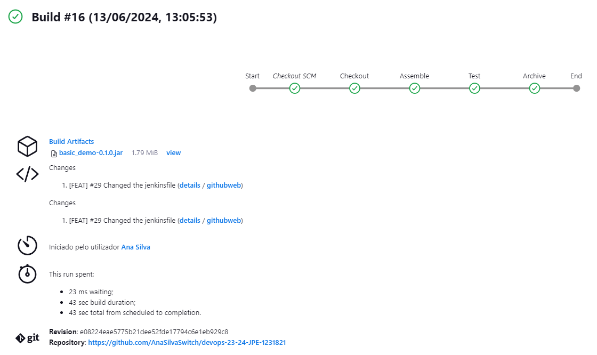

Also, we can check the results of the test:

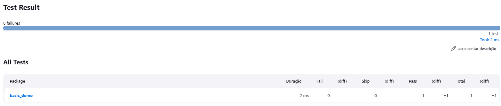

## 2. CA5 - Part2
 For the second part of the assignment, we  should define the following stages in our pipeline:
 Checkout, Assemble, Test, Javadoc, Archive and Publish Image.

For this, firstly we need to install some plugins

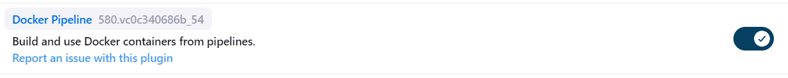


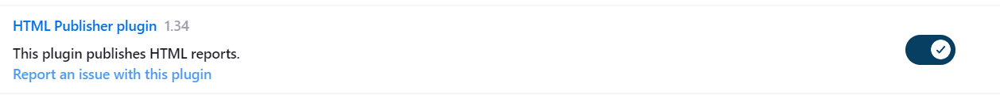

We also need credentials to dockerhub:

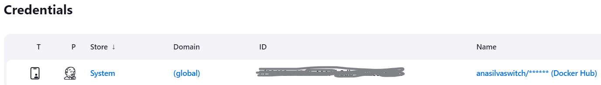

At this point we are ready to compose our Jenkinsfile:

```groovy
pipeline {
    agent any

    environment {
        DOCKER_CREDENTIALS_ID = 'anasilvaswitch/****** (Docker Hub)'
        DOCKER_IMAGE = 'anasilvaswitch/springbootapp'
        DOCKER_TAG = "${env.BUILD_ID}"
    }

    stages {
        stage('Checkout') {
            steps {
                echo 'Checking out the code...'
                git branch: 'main', url: 'https://github.com/AnaSilvaSwitch/devops-23-24-JPE-1231821.git'
            }
        }

        stage('Set Permissions') {
            steps {
                dir('CA2/Part2/') {
                    echo 'Setting executable permissions on gradlew...'
                    bat 'gradlew.bat'
                }
            }
        }

        stage('Assemble') {
            steps {
                dir('CA2/Part2/') {
                    echo 'Assembling the application...'
                    bat './gradlew.bat assemble'
                }
            }
        }

        stage('Test') {
            steps {
                dir('CA2/Part2/') {
                    echo 'Running unit tests...'
                    bat './gradlew.bat test'
                }
            }
        }

        stage('Javadoc') {
            steps {
                dir('CA2/Part2/') {
                    echo 'Generating Javadoc...'
                    bat './gradlew.bat javadoc'
                    publishHTML(target: [
                        allowMissing: false,
                        alwaysLinkToLastBuild: false,
                        keepAll: true,
                        reportDir: 'build/docs/javadoc',
                        reportFiles: 'index.html',
                        reportName: 'Javadoc'
                    ])
                }
            }
        }

        stage('Archive') {
            steps {
                dir('CA2/Part2/') {
                    echo 'Archiving artifacts...'
                    archiveArtifacts artifacts: 'build/libs/*.jar', fingerprint: true
                }
            }
        }

        stage('Create Dockerfile') {
            steps {
                dir('CA2/Part2/') {
                    script {
                        def dockerfileContent = """
                        FROM openjdk:11-jre-slim
                        WORKDIR /app
                        COPY build/libs/*.jar app.jar
                        EXPOSE 8080
                        ENTRYPOINT ["java", "-jar", "app.jar"]
                        """
                        writeFile file: 'Dockerfile', text: dockerfileContent
                    }
                }
            }
        }

        stage('Publish Image') {
            steps {
                script {
                    echo 'Building and publishing Docker image...'
                    docker.withRegistry('https://index.docker.io/v1/', "${DOCKER_CREDENTIALS_ID}") {
                        dir('CA2/Part2/') {
                            def customImage = docker.build("${DOCKER_IMAGE}:${DOCKER_TAG}")
                            customImage.push()
                            customImage.push('latest')
                        }
                    }
                }
            }
        }
    }
}
```

After building the pipeline, we should see the result like this:

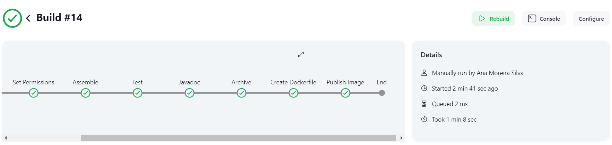

### Building and publishing Docker image:

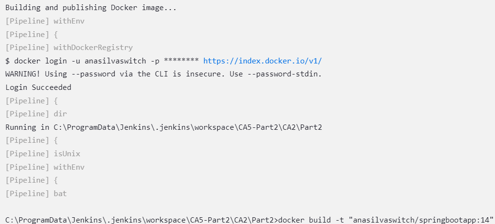
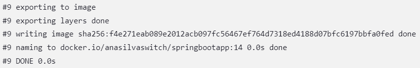

As it also can be seen in the Docker Hub:

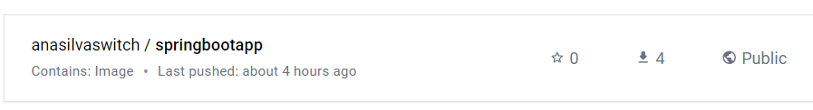

### Javadoc:
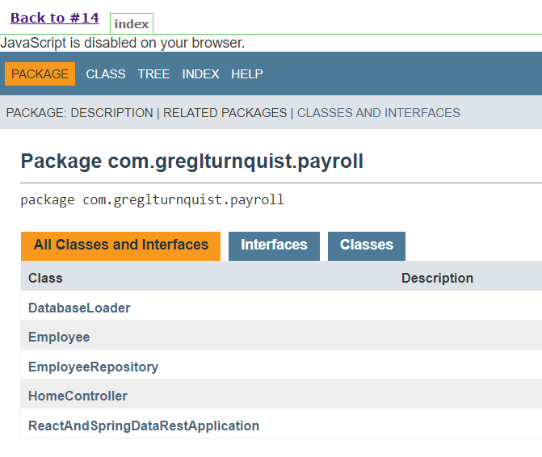


## Conclusion
By following the steps outlined in this report, we can successfully set up and configure a Jenkins pipeline for our 
Gradle basic demo project. This continuous integration setup ensures that our project is consistently built, tested, and 
archived, enhancing the overall development workflow and maintaining high-quality standards.

